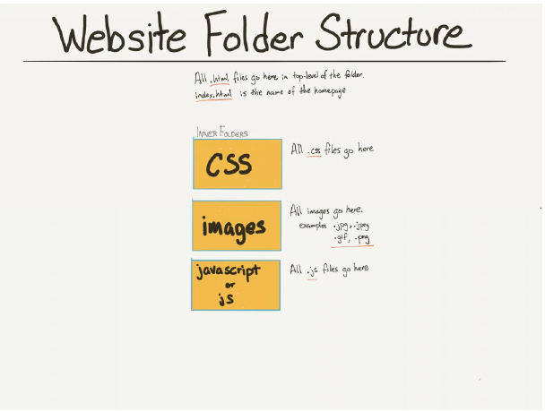

# FrontEnd-FinalProject
Final Project for the Front-End course using HTML, CSS and JavaScript
1. Make a new repository
2. Create a new project. This new project will be a personal landing page as a CV with your personal information. This landing page should contains information as : personal photo, personal contact information (name, age, email, etc.), professional information (work experience, etc.), information about your degree (university, some courses, etc.). You could also add information about your hobbies and something about you. Let’s add also a contact box where to put the email and maybe your links to social media.
3. The repository should contain a folder structure. For example: you should have a general folder in which you could have a folder for css, one for js, one for media (images) and the html.

4. I recommend to not work directly on main branch but to have at least a develop branch and some other branches which will have as parent develop branch where you will add features. I recommend to split in pieces your site by commits. To not load all landing page in one commit.
5. Try to work clean respecting indentation, spaces where needed and a good naming for classes. Avoid generic names and try to be more specific.
